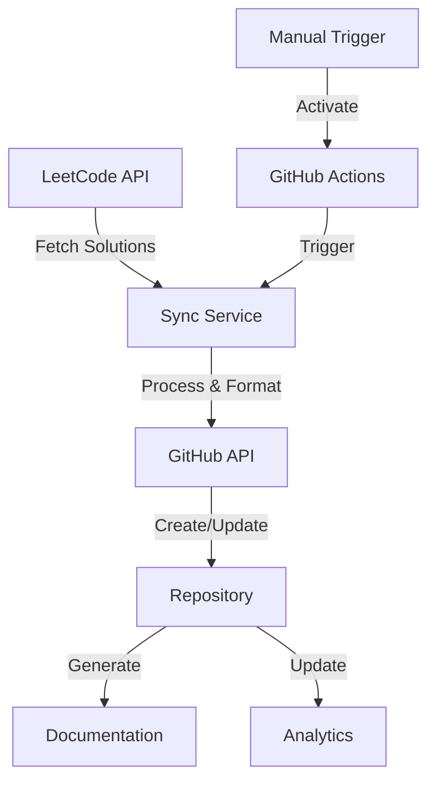

<div align="center">

# 🏆 LeetCode Solutions Archive

[](https://github.com/TheToriqul/leetcode-solutions/actions)
[](https://github.com/TheToriqul/leetcode-solutions/commits/main)
[](LICENSE)
[](https://www.python.org/)
[](https://leetcode.com/u/TheToriqul/)
[](https://github.com/TheToriqul)

An enterprise-grade automation system that synchronizes, organizes, and documents your LeetCode solutions with comprehensive analytics and documentation.

[Features](#-key-features) • [Setup](#-setup-guide) • [Usage](#-usage) • [Documentation](#-documentation) • [Contributing](#-contributing) • [Contact](#-contact)

</div>

## 📋 Table of Contents

- [Key Features](#-key-features)
- [System Architecture](#-system-architecture)
- [Project Structure](#-project-structure)
- [Setup Guide](#-setup-guide)
- [Usage](#-usage)
- [Documentation](#-documentation)
- [Solution Structure](#-solution-structure)
- [Tech Stack](#-tech-stack)
- [Contributing](#-contributing)
- [Analytics](#-analytics)
- [Roadmap](#-roadmap)
- [Contact](#-contact)
- [License](#-license)

## 🚀 Key Features

- **Automated Synchronization**: Daily automatic sync of your LeetCode solutions (my workflow will run at midnight (00:00) on the first day of every month. Modify for your own schedule)
- **Smart Organization**: Solutions categorized by difficulty and topics
- **Comprehensive Documentation**: Detailed README for each problem
- **Multi-language Support**: Handles solutions in various programming languages
- **Performance Tracking**: Runtime and memory usage statistics
- **Version Control**: Complete history of solution improvements
- **GitHub Actions Integration**: Automated workflow with manual trigger option
- **Analytics Dashboard**: Track your progress and improvements
- **Custom Tagging**: Organize solutions by patterns and techniques

## 🏗️ System Architecture



## 📁 Project Structure

```
leetcode-solutions/
├── 📂 easy/
│   └── ####-problem-name/
│       ├── README.md          # Problem description & stats
│       ├── solution.{ext}     # Solution implementation
│       └── test_cases.json    # Test cases and examples
├── 📂 medium/
├── 📂 hard/
├── 📂 .github/
│   └── workflows/
│       └── sync.yml          # GitHub Actions workflow
├── 📂 scripts/
│   ├── sync_leetcode.py      # Main sync script
│   └── utils/                # Helper utilities
├── 📜 README.md              # Main documentation
└── 📊 stats/                 # Performance analytics
```

## ⚙️ Setup Guide

### Prerequisites

- GitHub Account with repository access
- LeetCode Account
- Python 3.10 or higher
- Git CLI

### Detailed Configuration Steps

1. **Repository Setup**
   ```bash
   # Clone the repository
   git clone https://github.com/thetoriqul/leetcode-solutions.git
   cd leetcode-solutions
   
   # Install dependencies
   pip install -r requirements.txt
   ```

2. **Environment Configuration**
   ```bash
   # Create .env file
   cp .env.example .env
   
   # Add your configuration
   GH_PAT=your_github_token
   LEETCODE_SESSION=your_leetcode_session (Remeber, you have to regularly monitor the credentials)
   GITHUB_REPO=thetoriqul/leetcode-solutions
   ```

3. **GitHub Secret Configuration**
   
   Navigate to: `Settings > Secrets and Variables > Actions`
   
   Required Secrets:
   ```yaml
   GH_PAT: your_github_personal_access_token
   LEETCODE_SESSION: your_leetcode_session_cookie (Remeber, you have to regularly monitor the credentials)
   ```

4. **GitHub Personal Access Token Setup**
   - Visit: `Settings > Developer settings > Personal access tokens > Tokens (classic)`
   - Required Scopes:
     ```
     - repo (Full control of private repositories)
     - workflow (Update GitHub Action workflows)
     - admin:org (Optional: For organization-level access)
     ```

5. **LeetCode Session Token Retrieval**
   ```javascript
   // Browser DevTools (F12) -> Console
   document.cookie.split(';').find(cookie => 
     cookie.includes('LEETCODE_SESSION')
   ).split('=')[1]
   ```

## 🎯 Usage

### Automatic Synchronization
Solutions are automatically synchronized at midnight (00:00) on the first day of every month.

### Manual Synchronization
1. Visit the Actions tab
2. Select "Sync LeetCode Solutions"
3. Click "Run workflow"
4. Select branch (default: main)
5. Trigger the workflow

### Custom Synchronization
```bash
# Run sync script locally
python scripts/sync_leetcode.py --days 7  # Sync last 7 days
python scripts/sync_leetcode.py --all     # Sync all solutions
```

## 📖 Documentation

### Solution Documentation Structure
Each solution includes:
```markdown
# Problem Title

## Difficulty: [Easy/Medium/Hard]
## Topics: [Array, String, Dynamic Programming, etc.]

## Problem Description
[Detailed problem statement]

## Approach
- Time Complexity: O(n)
- Space Complexity: O(1)
[Detailed approach explanation]

## Solution Stats
| Metric  | Value |
|---------|-------|
| Runtime | x ms  |
| Memory  | x MB  |
| Date    | YYYY-MM-DD |

## Code Implementation
[Solution with comments]

## Test Cases
[Example test cases]
```

## 🛠️ Tech Stack

### Core Technologies
- **Python 3.10+**: Core implementation
- **GitHub Actions**: Automation workflow
- **Docker**: Containerization (optional)

### Dependencies
- **PyGithub**: GitHub API integration
- **requests**: HTTP client for LeetCode API
- **python-dotenv**: Environment management
- **pytest**: Testing framework
- **black**: Code formatting
- **isort**: Import sorting

### Development Tools
- **pre-commit**: Git hooks
- **flake8**: Linting
- **mypy**: Type checking

## 👥 Contributing

We welcome contributions! Please follow these steps:

1. Fork the repository
2. Create a feature branch
   ```bash
   git checkout -b feature/amazing-feature
   ```
3. Commit your changes using conventional commits
   ```bash
   git commit -m 'feat: add amazing feature'
   ```
4. Push to your branch
   ```bash
   git push origin feature/amazing-feature
   ```
5. Open a Pull Request

### Commit Convention
```
feat: New feature
fix: Bug fix
docs: Documentation update
style: Code style update
refactor: Code refactoring
test: Test update
chore: Build tasks update
```

## 📊 Analytics

Track your LeetCode progress with built-in analytics:

- Solution success rate
- Runtime percentile
- Memory usage percentile
- Problem-solving patterns
- Time complexity distribution
- Language usage statistics

## 🗺️ Roadmap

### Phase 1 (Q1 2024)
- [ ] Solution performance analytics dashboard
- [ ] Multiple language template support
- [ ] Automatic complexity analysis

### Phase 2 (Q2 2024)
- [ ] Integration with LeetCode contests
- [ ] Custom solution tagging system
- [ ] AI-powered solution suggestions

### Phase 3 (Q3 2024)
- [ ] Interactive learning paths
- [ ] Community contribution features
- [ ] Performance optimization tools

## 📬 Contact

Connect with me:

- Portfolio: [thetoriqul.com](https://thetoriqul.com)
- Email: [toriqul.int@gmail.com](mailto:toriqul.int@gmail.com)
- LinkedIn: [thetoriqul](https://www.linkedin.com/in/thetoriqul/)
- GitHub: [@TheToriqul](https://github.com/TheToriqul)
- Phone: +65 8936 7705, +8801765 939006

## 📄 License

This project is licensed under the MIT License - see the [LICENSE](LICENSE) file for details.

---

<div align="center">

**[⬆ back to top](#-leetcode-solutions-archive)**

Built with ❤️ by [TheToriqul](https://github.com/TheToriqul)

</div>